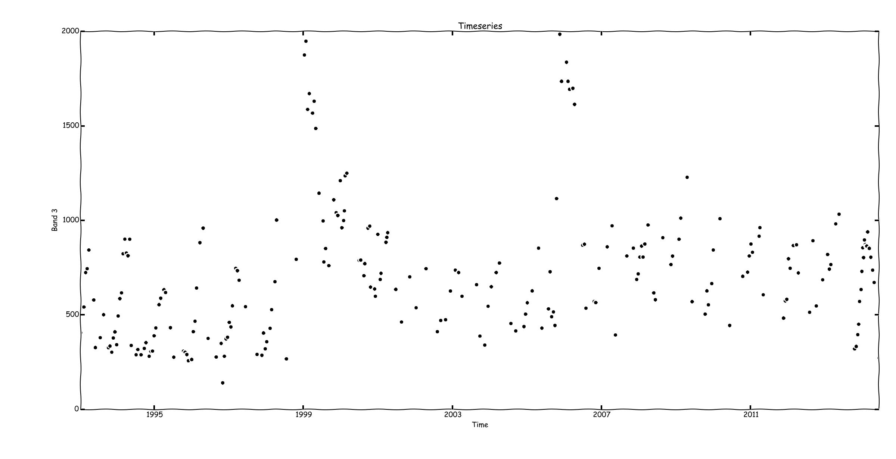
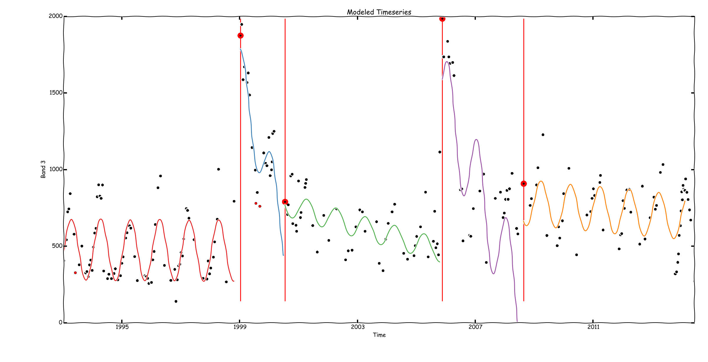

Yet Another Timeseries Model (YATSM)
------------------------------------

## About
The Yet Another TimeSeries Model (YATSM) algorithm is designed to monitor land
surface phenomena, including land cover and land use change, using timeseries
of remote sensing observations. The algorithm seeks to find distinct time
periods within the timeseries, or time segments, by monitoring for disturbances. These time segments may be used to infer continuous periods of stable land cover, with breaks separating the segments representing ephemeral disturbances or permanent conversions in land cover or land use.

The "Yet Another..." part of the algorithm name is an acknowledgement of the influence a previously published timeseries algorithm - the Continuous Change Detection and Classification (CCDC) (Zhu and Woodcock, 2014) algorithm. While YATSM began as an extension from CCDC, it was never intended as a 1 to 1 port of CCDC and will continue to diverge in its own direction.

This algorithm is also influenced by other remote sensing algorithms which, like CCDC, are based in theory on tests for structural change from econometrics
literature (Chow, 1960; Andrews, 1993; Chu *et al*, 1996; Zeileis, 2005). These other remote sensing algorithms include Break detection For Additive Season and Trend (BFAST) (Verbesselt *et al*, 2012) and LandTrendr (Kennedy *et al*, 2010). By combining ideas from CCDC, BFAST, and LandTrendr, this "Yet Another..." algorithm hopes to overcome weaknesses present in any single approach.

## Documentation

Documentation is available [here](http://ceholden.github.io/yatsm/).

Contributions to the documentation, especially for the user guide, is more than welcomed. The documentation for this project is built using [Sphinx](http://sphinx-doc.org/) using the [ReadTheDocs](https://readthedocs.org/) theme. See the `docs/` folder for documentation source material.

## Example
The simplest way of using YATSM would be the pixel-by-pixel command line interface - `run_yatsm.py`.

We'll use the example [Landsat stack from Chiapas, Mexico](https://github.com/ceholden/landsat_stack) for this demonstration:

    > run_yatsm.py --consecutive=5 --threshold=3 --min_obs=16 \
    ... --freq=1 --min_rmse 100 --test_indices "2 4 5" --screening RLM \
    ... --plot_index=2 --plot_style xkcd \
    ... ../landsat_stack/p022r049/images/ 133 106

Produces:
    
    

## Requirements
#### Main dependencies:

    Python (2.7.x tested)
    GDAL (1.10.0 tested)

#### Python dependencies:
Listed below are the Python library requirements for running YATSM. The version numbers listed are the versions I've used for development, but I suspect the versions are flexible.

    cython >= 0.20.1
    numpy >= 1.8.1
    pandas >= 0.13.1
    statsmodels >= 0.5.0
    glmnet = 1.1-5 (see: https://github.com/dwf/glmnet-python)
    scikit-learn >= 0.15.1
    ggplot >= 0.5.8
    docopt >= 0.6.1
